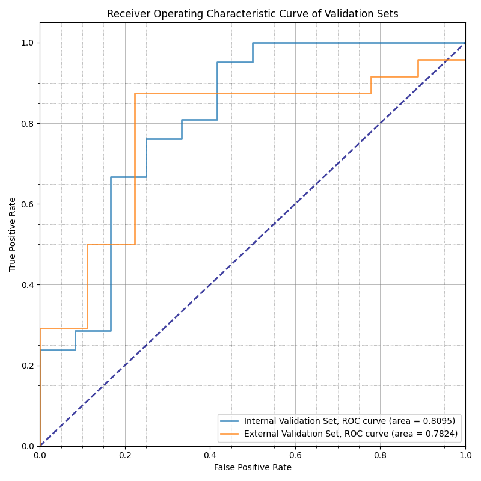
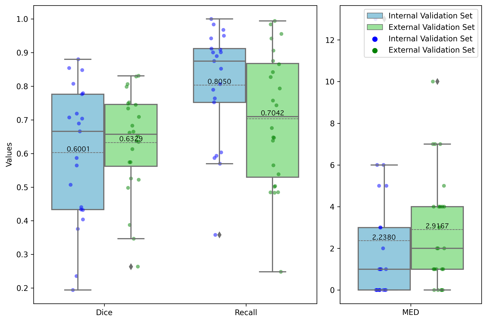

# Developing and validating a model to identify radiation-resistant populations and detect the location of radiation-resistant region in NSCLC patients undergoing radiotherapy

## Introduction

The dataset comprises 217 patients with NSCLC (147 radiation resistant (RR), 70 radiation sensitive (RS)). These patients were treated with radiotherapy at four institutions, and pre-treatment and post-treatment CT images were obtained at 1–3 months of follow-up. A two-stage U-Net framework was developed for identifying radiation-resistant populations and detecting radiation-resistant regions within the tumor before radiotherapy. The framework of our proposed method is shown below.

Figure 1. Workflow of the multi-center study for PS population screening and model design.

## Results

The proposed method achieved an Area Under the Receiver Operating Characteristic Curve (AUC) of 0.8095 and an accuracy rate of 81.82% in identifying radiation-resistant populations. Furthermore, within the RR patients, the model demonstrated a recall rate of 0.8050 in identifying radiation-resistant regions within the primary tumor. By broadening the margins of our model's predictions by an average of 2 mm, we achieved a favorable overlap with the radiation-resistant region (average recall of 0.8983 for the internal validation set and 0.8567 for the external validation set).

Figure 2. ROC curves for the predictive outcomes on internal and external validation sets.

Figure 3. Predictive outcomes for radiation-resistant regions within the partial response population post-treatment.

## Usage

For the Identifying radiation-resident populations task, use the following script `src/pytorch_lightning/inference_cls.py`.

For the Locating of Radioresistant Regions task, use the following script `src/pytorch_lightning/inference_seg.py`.

Model weights can be downloaded at this [link (Google Drive)](https://drive.google.com/drive/folders/1p_Wxbh0hsQC5u2Aw2988yPaDhHD6GP5Y?usp=share_link).